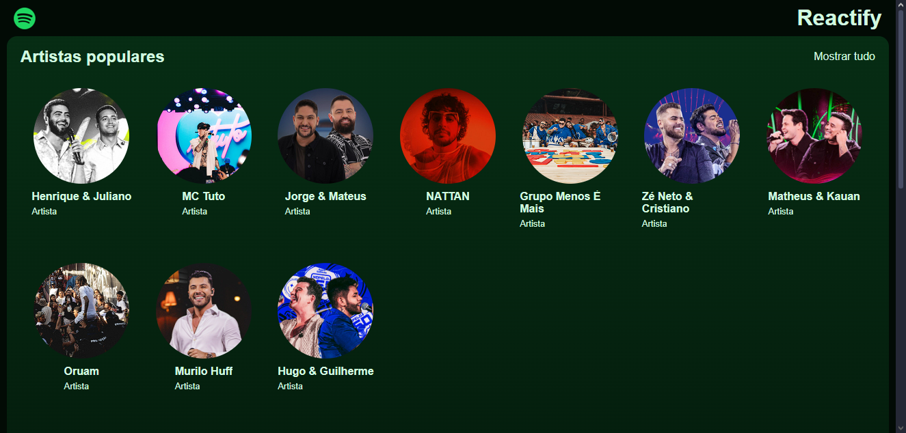

#  [Reactify](https://reactify-pztc.onrender.com/) 

Clone do Spotify utilizando React e Vite.

## Tecnologias utilizadas

### Contribuições

Sintam-se livres para adicionar recursos, corrigir problemas, polir o código ou usá-lo de referência.

### Créditos

Este projeto foi desenvolvido como parte de um bootcamp educacional da Hashtag Treinamentos no programa Fullstack Impressionador. 
